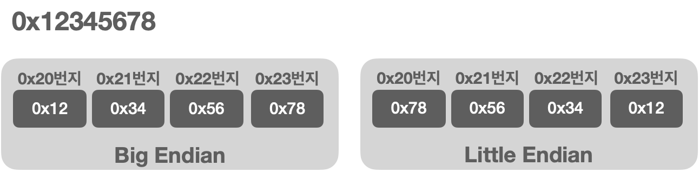
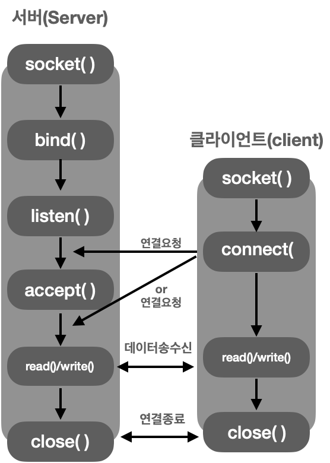
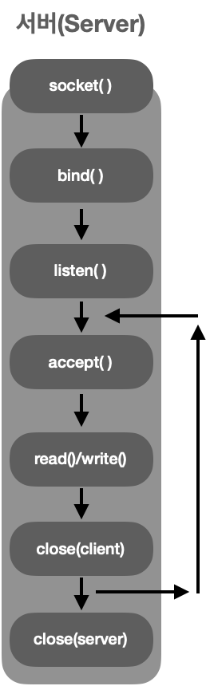

# socketProgrammingStudy
Study about Socket Programming

## Work Flow about Socket Programming
### Server Socket
- Socket 생성
- bind(IP, Port등을 설정)
- listen
- accept

### Client Socket
- Socket 생성
- connect

## Socket Protocol
### Socket 생성
**int socket(int domain, int type, int protocol);**<br>
socket Parameters
- domain: 소켓이 사용할 프로토콜 체계(Protcol Family)정보 전달
- type: 소켓의 데이터 전송방식에 대한 정보 전달
- protocol: 두 컴퓨터간 통신에 사용되는 프로토콜 정보 전달

### 프로토콜 체계(Protocol Family)
- PF_INET: IPv4 인터넷 프로토콜 체계
- PF_INET6: IPv6 인터넷 프로토콜 체계
- PF_LOCAL: 로컬 통신을 위한 UNIX 프로토콜 체계
- PF_PACKET: Low Level 소켓을 위한 프로토콜 체계
- PF_IPX: IPX노벨 프로토콜 체계

### 소켓의 타입(Type)
소켓의 데이터 전송방식 
1. 연결지향형 소켓(SOCK_STREAM)
Socket 함수의 두번째 인자로 SOCK_STREAM을 전달하면 연결지향형 소켓이 생성
   - 중간에 데이터가 소멸되지 않고 목적지로 전송
   - 전송 순서대로 데이터가 수신
   - 전송되는 데이터의 경계가 존재하지 않음
   - 연결 지향형 소켓은 다른 연결지향형 소켓 하나와만 연결 가능

2. 비 연결지향형 소켓(SOCK_DGRAM)
Socket 함수의 두번째 인자로 SOCK_DGRAM을 전달하면 비 연결지향형 소켓이 생성
   - 전송된 순서에 상관없이 가장 빠른 전송을 지향
   - 전송된 데이터는 손실의 우려가 있ㅅ고, 파손의 우려가 존재
   - 전송되는 데이터의 경계가 존재
   - 한번에 전송할 수 있는 데이터의 크기가 제한

### 프로토콜의 최종선택
최종적으로 소켓이 사용하게 될 프로토콜 정보를 전달하는 목적으로 존재, 즉, 소켓의 데이터 전송방식은 같지만 그 안에서도 프로토콜이 나뉘는 상황이 존재할 수 있어 프로토콜 정보를 조금 더 구체화함 <br>
Ex]<br> 
TCP 소켓: socket(PF_INET, SOCK_STREAM, IPPROTO_TCP); <br>
UDP 소켓: socket(PF_INET, SOCK_DGRAM, IPPROTO_UDP); 

## 주소정보의 표현
```
struct sockaddr_in
{
    sa_family_t     sin_family; // 주소체계(Address Family)
    uint16_t        sin_port;   // 16비트 TCP/UDP PORT 번호
    struct in_addr  sin_addr;   // 32비트 IP주소
    char            sin_zero[8] // 사용되지 않음
}
```
```
struct in_addr
{
    in_addr_t   s_addr; //32bit IPv4 인터넷 주소
}
```

### 구조체 sockaddr_in의 멤버에 대한 분석
- 멤버 sin_family
  - AF_INET: IPv4 인터넷 프로토콜에 적용하는 주소체계
  - AF_INET6: IPv6 인터넷 프로토콜에 적용하는 주소 체계
  - AF_LOCAL: 로컬 통신을 위한 유닉스 프로토콜의 주소 체계
- 멤버 sin_port
  - 16bit PORT 번호를 저장, 단 '네트워크 바이트 순서'로 저장해야 함
- 멤버 sin_addr
  - 32bit IP 주솟정보를 저장, 단 '네트워크 바이트 순서'로 저장해야 함
- 멤버 sin_zero
  - 특별한 의미를 지니지 않는 멤버, 단순히 구조체 sockaddr_in의 크기를 구조체 sockaddr와 일칫시키기 위해 삽입된 멤버 But, 반드시 0으로 채워야 함

## 네트워크 바이트 순서와 인터넷 주소 변환
CPU에 따라 4바이트 정수 1을 메모리 공간에 저장하는 방식이 달라질 수 있음. 이러한 부분을 고려하지 않고서 데이터를 송수신하면 문제가 발생할 수 있음

### 바이트 순서(Order)와 네트워크 바이트 순서
CPU가 데이터를 메모리에 저장하는 방식은 다음과 같이 2가지로 나뉨
- 빅 엔디안(Big Endian): 상위 바이트의 값을 작은 번지수에 저장
- 리틀 엔디안(Little Endian): 상위 바이트의 값을 큰 번지수에 저장



데이터 저장 방식은 CPU마다 다름 그래서 CPU의 데이터 저장방식을 의미하는 호스트 바이트 순서(Host Byte Order)는 CPU에 따라 차이가 남(ex] Intel계열 CPU는 리틀 엔디안 방식으로 데이터를 저장)

데이터를 저장하는 방식의 문제점 때문에 네트워크를 통해 데이터를 전송할 때는 통일된 기준으로 데이터를 전송하기로 약속했으면 이 약속을 가리켜 네트워크 바이트 순서(Network Byte Order)라 함. 네트워크 바이트 순서의 약속은 **빅 엔디안 방식으로의 통일**, 즉 네트워크 상으로 데이터를 전송할 때는 데이터의 배열을 빅 엔디안 기준으로 변경해서 송수신 해야함

### 바이트 순서의 변환(Endian Conversions)
sockaddr_in 구조체 변수에 값을 채우기 앞서 네트워크 바이트 순서로 변환해서 저장해야 함
```
unsigned short htons(unsigned short);
unsigned short ntohs(unsigned short);
unsigned long htonl(unsigned long);
unsigned long ntohl(unsigned long);
```
h: h는 호스트(host) 바이트 순서를 의미 <br>
n: n은 네트워크(network) 바이트 순서를 의미 <br>
s: short, l: long 을 의미 <br>

ex] <br>
htons: short형 데이터를 호스트 바이트 순서에서 네트워크 바이트 순서로 변환<br>
ntohs: short형 데이터를 네트워크 바이트 순서에서 호스트 바이트 순서로 변환

### 인터넷 주소의 초기화와 할당
inet_aton 함수도 기능상으로는 inet_addr 함수와 동일. 즉, 문자열 형태의 IP주소를 32비트 정수, 그것도 네트워크 바이트 순서로 정렬해서 반환
```
int inet_aton(const char* string, struct in_addr* addr)
```
- Parameter <br>
string: 변환할 IP주소 정보를 담고 있는 문자열의 주소 값 전달 <br>
addr: 변환된 정보를 저장할 in_addr 구조체 변수의 주소 값 전달 <br>
- Return <br>
1: Success / 0: Fail

```
char* inet_ntoa(struct in_addr adr);
```
inet_aton과 반대로 작동하는 함수로써  인자로 전달된 정수형태의 IP정보를 참조하여 문자열 형태의 IP정보로 변환함. 변환된 문자열의 주소 값을 반환
- Return <br>
성공 시 변환된 문자열의 주소 값, 실패 시 -1 반환

## TCP기반 서버/클라이언트
### 연결요청 대기상태로의 진입
```
int listen(int sock, int backlog);
```
- Parameter <br>
sock: 연결요청 대깃상태에 두고자 하는 소켓의 file descriptor <br>
backlog: 연결요청 대기 큐(Queue)의 크기정보 전달, 5가 전달되면 큐의 크기가 5가 되어 클라이언트의 연결요청을 5개까지 대기시킬 수 있음
- Return <br>
0: Success / -1: Fail

### 클라이언트의 연결요청 수락
```
int accept(int sock, struct sockaddr* addr, socklen_t* addrlen);
```
- Parameter <br>
sock: 서버 소켓의 file descriptor <br>
addr: 연결요청 한 클라이언트의 주소정보를 담을 변수의 주소 값 전달, 함수 호출이 완료되면 인자로 전달된 주소의 변수에는 클라이언트의 주소정보가 채워짐
addrlen: 두 번째 매개변수 addr에 전달된 주소의 변수 크기를 바이트 단위로 전달
- Return <br>
socket의 file descriptor number: Success / -1: Fail

accept 함수는 연결요청 대기 큐에서 대기중인 클라이언트의 연결요청을 수락하는 기능의 함수. accept 함수는 호출성공 시 내부적으로 데이터 입출력에 사용할 소켓을 생성하고, 그 소켓의 file desriptor를 반환함

### TCP 클라이언트 기본 함수
```
int connect(int sock, struct sockaddr* servaddr, socklen_t addrlen);
```
- Parameter <br>
sock: 클라이언트 소켓의 파일 디스크립터 전달 <br>
servaddr: 연결요청 할 서버의 주소정보를 담은 변수의 주소 값 전달 <br>
addrlen: 두 번째 매개변수 servaddr에 전달된 주소의 변수 크기를 바이트 단위로 전달 <br>
- Return <br>
0: Success / -1: Fail



<br>

## Iterative 기반의 서버


## TCP 기반의 Half-close
```
int shutdown(int sock, int howto)
```
- Parameter <br>
sock: 종료할 소켓의 파일 디스크립터 전달 <br>
howto: 종료방법에 대한 정보 전달 <br>
    - SHUT_RD: 입력 스트림 종료
    - SHUT_WR: 출력 스트림 종료
    - SHUT_RDWR: 입출력 스트림 종료
- Return <br>
0: Success / -1: Fail

## Domain Name System
```
struct hostent* gethostbyname(const char* hostname);
```
성공시 hostent 구조체 변수의 주소 값, 실패시 NULL 포인터 변환<br>
변환하고자 하는 도메인의 이름을 문자열 형태로 전달하면 해당 도메인의 IP 주소정보가 반환
```
struct hostent
{
    char* h_name;       // official name
    char** h_aliases    // alias list
    int h_addrtype;     // host address type
    int h_length;       // address length
    char** h_addr_list  // address list
}
```
hname: 공식 도메인 이름, 도메인의 대표 이름. <br>
h_aliases: 하나의 IP에 둘 이상의 도메인 이름을 지정할 경우 공식 도메인 이름 이외에 해당 메인 페이지에 접속할 수 있는 다른 도메인 이름 <br>
h_addrtype: ip 주소의 주소체계(ipv4, ipv6, ...) <br>
h_length: ip주소의 크기정보(ipv4: 4bytes, ipv6: 16bytes) <br>
h_addr_list: IP 주소가 정수의 형태로 반환

```
struct hostent* gethostbyaddr(const char* addr, socklen_t len, int family);
```
- Parameter <br>
addr: IP주소를 지니는 in_addr 구조체 변수의 포인터 전달, IPv4 이외의 다양한 정보를 전달받을 수 있도록 일반화하기 위해 매개변수를 char형 포인터로 선언 <br>
len: 첫 번째 인자로 전달된 주소정보의 길이, IPv4의 경우 4, IPv6의 경우 16 전달 <br>
family: 주소체계 정보 전달, IPv4의 경우 AF_INET, IPv6의 경우 AF_INET6 전달

## 시그널 핸들링
**시그널(signal)** 은 특정상황이 발생했음을 알리기 위해 운영체제가 프로세스에게 전달하는 메시지를 의미, 그 메시지에 반응해 메시지와 연관하여 미리 정의된 작업이 진행되는 것을 가리켜 **핸들링** 또는 **시그널 핸들링** 이라 함
```
#include <signal.h>
void (*signal(int signo, void (*func)(int)))(int);
```
시그널 발생시 호출되도록 이전에 등록된 함수의 포인터 반환
- 함수이름 : signal
- 매개변수 선언: int signo, void (*func)(int)
- 반환형: 매개변수형이 int이고 반환형이 void인 함수 포인터

- Parameter
  - signo: 특정 상황에 대한 정보
    - SIGALRM: alarm 함수호출을 통해서 등록된 시간이 된 상황
    - SIGINT: CTRL+C가 입력된 상황
    - SIGCHILD: 자식 프로셋가 종료된 상황

시그널이 발생하면 sleep 함수의 호출로 블로킹 상태에 있던 프로세스가 깨어남
```
int sigaction(intt signo, const struct sigaction* act, struct sigaction* oldact)
```
- Parameter <br>
signo: signal 함수와 마찬가지로 signal의 정보를 인자로 전달 <br>
act: 첫 번째 인자로 전달된 상수에 해당하는 시그널 발생시 호출될 함수(시그널 핸들러)의 정보전달 <br>
oldact: 이전에 등록되었던 시그널 핸들러의 함수 포인터를 얻는데 사용되는 인자, 필요 없다면 0 전달
- Return <br>
0: Success / -1: Fail
```
struct sigaction
{
    union __sigaction_u __sigaction_u;
    sigset_t sa_mask
    int sa_flags
}
```
```
union __sigaction_u {
	void    (*__sa_handler)(int);
	void    (*__sa_sigaction)(int, struct __siginfo *,
	    void *);
};
```
sa_handler에 시그널 핸들러의 함수 포인터 값(주소 값)을 저장, 나머지는 0으로 초기화 <br>
**sigaction이 signal보다 훨씬 더 안정적, signal 보단 sigaction을 사용**

